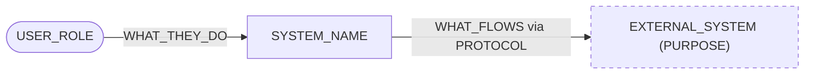
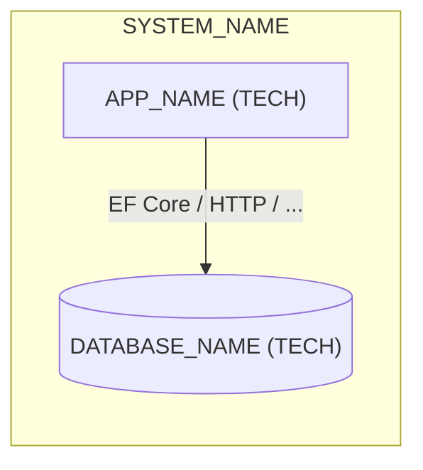
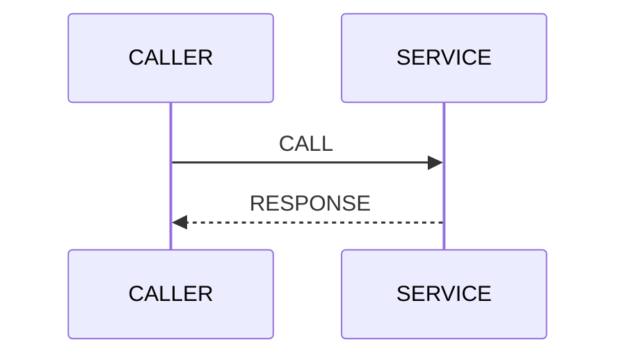

# Architecture

<!-- Template: replace every {placeholder} (and every UPPER_CASE placeholder inside the Mermaid
     diagrams, which use that form so the template still renders) with what the code actually contains, and delete
     any section that has no real, repo-specific content. Keep this document about structure
     and intent; generated reference (API docs, ERDs) lives elsewhere and is linked. -->

## Purpose and scope

{One or two paragraphs: what the system does, who uses it, and what is deliberately out of scope.}

## System context

{One sentence on what the view shows.}

## Containers and projects

| Project | Responsibility | Depends on |
| --- | --- | --- |
| `src/{Project}` | {One line} | {Projects or services} |
| `tests/{Project}.Tests` | {What it covers} | {Projects} |

## Key flows

### {Flow name, e.g. "Placing an order"}

{One sentence on why this flow matters or is non-obvious.}

## Cross-cutting concerns

<!-- Keep only the concerns that have a real, repo-specific answer. -->

- **Configuration:** {where settings live, how they bind (options pattern), and how secrets are supplied}
- **Logging and telemetry:** {logging framework, OpenTelemetry, correlation}
- **Error handling:** {exception strategy, ProblemDetails, retries}
- **Security:** {authentication and authorization model}
- **Persistence:** {data access approach, migrations; link the generated data-model doc if there is one}

## Decisions

Significant decisions are recorded in the [decision log](decisions/README.md). The most
relevant to this architecture are:

- [ADR-{NNNN}](decisions/{NNNN}-{title}.md): {title}

## Constraints and quality goals

{Optional: hard constraints (platform, compliance) and the top quality goals, in priority order.}
