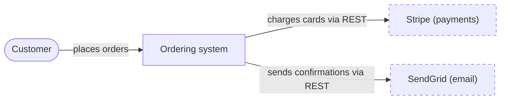
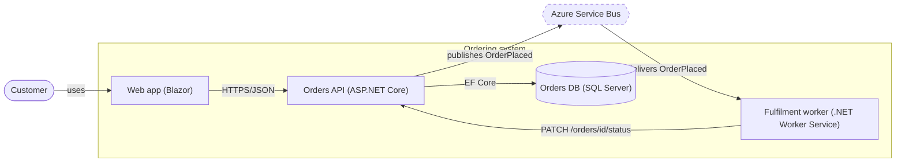
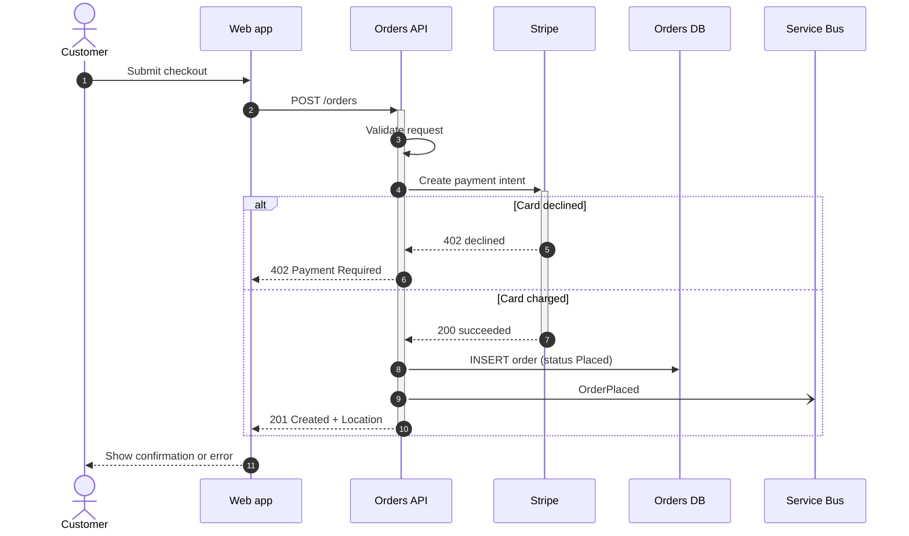
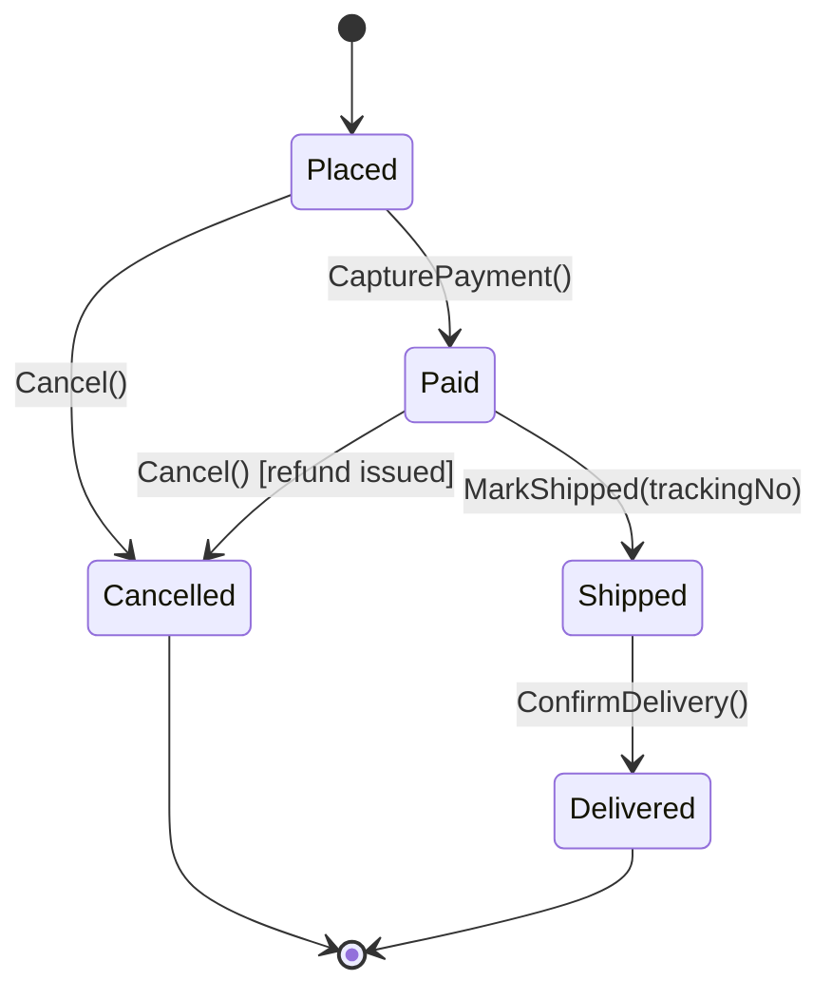
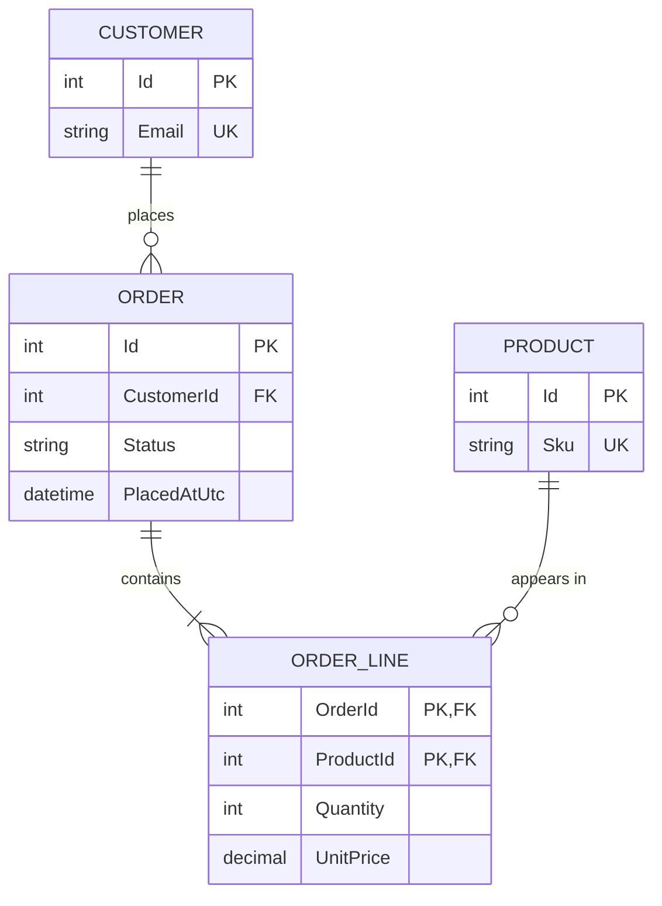
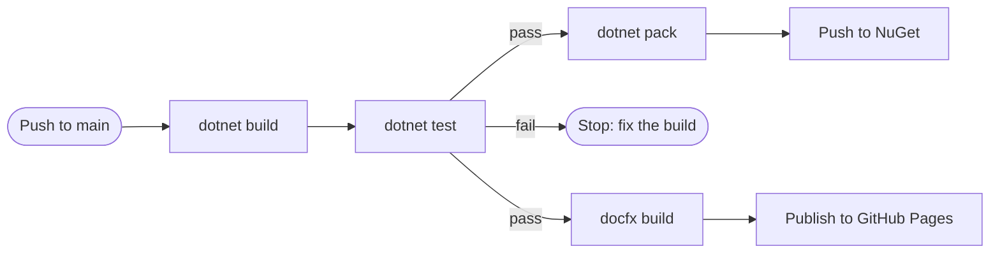
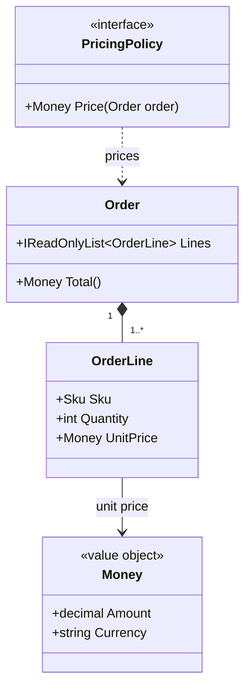

# Mermaid templates

Copy a template, then replace **every** node, label, and description with what the code
actually contains. These templates stick to syntax that renders on GitHub, DocFX (modern
template), and, for everything except the `flowchart` keyword, Azure DevOps. For Azure
DevOps, change `flowchart LR` to `graph LR`.

Shape conventions used throughout:

| Shape | Syntax | Use for |
| --- | --- | --- |
| Stadium | `id([Name])` | Person or role |
| Rectangle | `id["Name (tech)"]` | Container you own: app, API, worker, library |
| Cylinder | `id[("Name (tech)")]` | Database or durable store |
| Hexagon | `id{{"Name"}}` | Queue, topic, or event bus |
| Dashed border | `class id external` | System you don't own |

## 1. System context

Covers who uses the system and which external systems it depends on. There is one box for "our system".

## 2. Container view

This view opens up "our system" and shows its runnable or deployable parts and how they communicate.

## 3. Sequence: one use case

Shows the happy path plus the one or two alternative paths that matter. Keep it to 8 participants or fewer.

- `->>` is a call.
- `-->>` is a reply.
- `-)` is an asynchronous message.
- `+` and `-` activate and deactivate a participant.

## 4. State lifecycle

States and transitions must match the code, for example the enum and the methods that change it.
Label each transition with the method or event that causes it.

## 5. Entity relationships

**Generate this from the EF Core model when you can** (see the compatibility and tooling reference).
Hand-write it only when there is no EF model, and then show only the entities and key columns that
matter to the reader.

Cardinality markers are mirrored on each side of the line:

| Meaning | Left side | Right side |
| --- | --- | --- |
| Exactly one | `\|\|` | `\|\|` |
| Zero or one | `\|o` | `o\|` |
| Zero or more | `}o` | `o{` |
| One or more | `}\|` | `\|{` |

Use `--` for an identifying relationship and `..` for a non-identifying one. For example,
`CUSTOMER ||--o{ ORDER : places` reads "one customer places zero or more orders".

## 6. Pipeline or process flow

## 7. Small domain core (class diagram)

Use this only for a handful of stable, central types. Show the relationships and the few
members that explain them, not every property.

