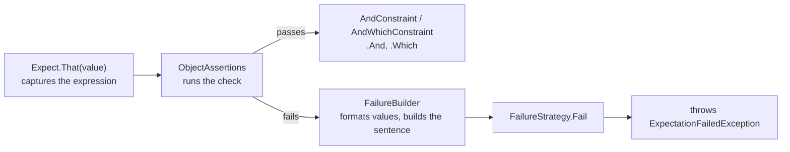

# Architecture

How Expectantly is put together, from the solution layout down to the types. For member-level
detail, see the [API reference](api-reference.md).

## Solution layout

```text
Expectantly.sln
├── Directory.Build.props         # shared settings: C# latest, nullable, warnings as errors
├── Directory.Packages.props      # central package versions
├── global.json                   # pins the .NET 10 SDK
├── src/Expectantly/              # the library (netstandard2.0; net8.0; net10.0)
│   ├── Expect.cs                 # static entry point
│   ├── ObjectAssertions.cs       # the only assertion surface today
│   ├── AndConstraint.cs          # .And chaining wrapper
│   ├── AndWhichConstraint.cs     # .And plus .Which for narrowing checks
│   ├── Failure.cs                # the parts of a failure sentence
│   ├── ExpectationFailedException.cs
│   ├── PublicAPI.*.txt           # tracked public API (PublicApiAnalyzers)
│   ├── Abstractions/             # public contracts: IAssertion, IAndConstraint
│   └── Internal/                 # failure pipeline, formatting and string diffs
├── tests/Expectantly.Tests/      # xUnit tests (net8.0; net10.0), organized by feature
└── docs/                         # this documentation set
```

The library multi-targets `netstandard2.0`, `net8.0` and `net10.0`
([ADR-0007](adr/0007-target-netstandard20-net80-and-net100.md)). The `net8.0` and later builds are
marked `IsTrimmable` and `IsAotCompatible`, so trimming and AOT warnings fail the build. It has no
runtime package dependencies: PolySharp (source-only polyfills), PublicApiAnalyzers and MinVer
(version from git tags) are build-time only.

## Assertion flow



1. **Entry point.** [`Expect.That`](../src/Expectantly/Expect.cs) wraps the value in an
   `ObjectAssertions<T>`. Its `[CallerArgumentExpression]` parameter records the source text of the
   value, for example `order.Total`, so messages can name it
   ([ADR-0004](adr/0004-capture-expressions-and-take-because-per-assertion.md)).

2. **Check.** Each method on [`ObjectAssertions<TActual>`](../src/Expectantly/ObjectAssertions.cs)
   evaluates its condition. On success it returns `AndConstraint<ObjectAssertions<TActual>>`, or
   `AndWhichConstraint<…>` when the check narrows the value
   ([ADR-0002](adr/0002-fluent-assertions-return-andconstraint-for-chaining.md),
   [ADR-0006](adr/0006-narrowing-assertions-return-andwhichconstraint.md)).

3. **Failure.** On failure the check fills in an internal `FailureBuilder` and passes the resulting
   [`Failure`](../src/Expectantly/Failure.cs) to `FailureStrategy.Fail`. No check throws directly
   ([ADR-0003](adr/0003-report-failures-through-a-failure-pipeline.md)). Today the only strategy
   throws [`ExpectationFailedException`](../src/Expectantly/ExpectationFailedException.cs), which
   carries the `Failure`. Soft-assertion scopes (PRD milestone M2) will install a collecting
   strategy here.

4. **Message.** `Failure.Message` is one sentence
   ([ADR-0005](adr/0005-write-failure-messages-as-one-sentence.md)):
   `Expected <subject> <expectation> [because <reason>], but <outcome>[, which <difference>].`
   Detail lines follow only for a pointer into a string.

## Internals

Everything under `Internal/` is `internal`, and the test project sees it through `InternalsVisibleTo`.

| Type | Role |
| --- | --- |
| `FailureStrategy`, `IFailureStrategy` | Where every failure goes. Only the throwing strategy exists today. |
| `FailureBuilder` | Collects the sentence parts; formats values passed to `Found`. |
| `ValueFormatter` | Culture-invariant formatting: quoted and escaped strings, `true`/`false`, `Type.Member` enums, C# type names, `[a, b, …]` collections capped at 10 items, nesting capped at 3 levels. Never throws. |
| `Strings`, `StringDiff` | Escaping and quoting; finding the first difference and drawing the pointer. |
| `Expressions`, `Reasons` | Turning caller expressions and `because` text into words for the sentence. |
| `TypeNames` | C# spellings of types: `int`, `List<string>`, `int?`. |

Assertion classes and the failure strategy carry `[StackTraceHidden]`, so on .NET 6 and later a
failure's stack trace starts at the test line.

## Abstractions

The interfaces under `Abstractions/` let future assertion types (collections, strings, numbers, and
so on) share a contract without depending on `ObjectAssertions<T>`:

- `IAssertion<out TActual>`: anything with an `Actual` value and the `Expression` that named it.
- `IAndConstraint<out TSelf>`: the `.And` chaining contract, implemented by `AndConstraint<TSelf>`
  and `AndWhichConstraint<TSelf, TValue>`.

`ObjectAssertions<TActual>` has a public constructor, `(TActual actual, string? expression = null)`,
so it can be created without `Expect.That`. There's no public API for writing custom assertions yet;
that is PRD milestone M2.

## Design conventions and decisions

- [Core API design notes](design/core-api.md): the naming (`IsX`, `HasX`, `ContainsX`),
  return-type and parameter-ordering conventions that new assertion methods follow.
- [Architecture decision records](adr/README.md): the reasons behind those conventions and other
  hard-to-reverse choices.
- [PRD](prd/expectantly-v1.md): requirements and milestones for 1.0.
