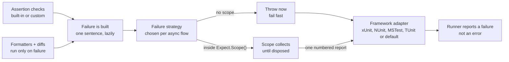

# Expectantly PRD: best-in-class .NET assertion library

_Last updated: 2026-09-28_

## Overview

Expectantly 1.0 is a synchronous-first, MIT-licensed, trimming- and AOT-safe .NET assertion library. Its failure messages name the asserted expression and pinpoint the difference, so a failed test is fixable without a debugger. This PRD turns research into the .NET and cross-language assertion landscape into buildable requirements; key sources are listed under References.

**Problem.** The .NET market has no library that combines a permissive license, modern foundations and first-rate failure output:

- FluentAssertions became commercial in v8 (January 2025).
- AwesomeAssertions (its Apache-2.0 fork) still identifies subjects by walking the stack and reading source files.
- Shouldly's equivalency is basic, and it has no assertion scopes.
- TUnit.Assertions and aweXpect require `await` on every assertion.

Expectantly today is about 150 lines at 0.x. It throws `InvalidOperationException` and has one catch-all assertion class.

**Positioning.** The modern synchronous successor to FluentAssertions: the same fluency, with compile-time expression capture, clearer messages, core soft assertions, and an MIT license that will not change.

### Goals

1. Every built-in failure names the subject expression, shows expected and actual, and pinpoints the difference (index, path, or missing and unexpected items).
2. Cover the assertions people use daily: values, strings, numbers, collections, dictionaries, exceptions, types, time, and object-graph equivalency.
3. Soft assertions and custom assertions behave exactly like built-ins.
4. Zero trimming or AOT warnings from the core package on `netstandard2.0`, `net8.0` and `net10.0`.
5. Migration code fixes convert the 20 most common FluentAssertions and xUnit `Assert` call shapes.

### Non-goals for 1.0

- Snapshot testing. Document integration with Verify instead.
- Mocking, a test runner, BDD syntax, or property-based testing.
- An async-only API. Only assertions that must wait are async.
- A second `x.Should()` syntax. One entry point, `Expect.That(x)`, keeps the API small. Revisit after 1.0.

## Users and use cases

The primary user is a .NET developer writing unit and integration tests who reads failure output in a CI log or an IDE test pane.

| User | Needs | 1.0 must deliver |
| --- | --- | --- |
| Test author (primary) | Write checks quickly; understand failures from the log alone | Type-specific IntelliSense, expression-named messages, diffs |
| Team leaving FluentAssertions | Avoid the commercial license without rewriting thousands of tests | Equivalency with options, `.Which` chaining, migration code fixes |
| Extension author | Add domain assertions (money, HTTP, JSON) that look native | Public failure and formatting API, a 10-line recipe |
| Library or AOT app team | Assertions in trimmed or Native AOT test apps | No reflection in the core, explicit framework adapters |
| CI owner | Failures reported as failures, not errors | Framework-native exceptions for xUnit, NUnit, MSTest and TUnit |

### User stories

1. As a test author, when `Expect.That(order.Total).Is(43)` fails, I see `order.Total`, `43` and `42` in one readable sentence, without opening a debugger.
2. As a test author, when two long strings differ, I see the index of the first difference with a marker, not two 500-character blobs.
3. As a test author, I wrap ten checks in `using (Expect.Scope())` and see all failures at once, numbered.
4. As a team leaving FluentAssertions, I run a code fix across the solution and most `Should()` calls become `Expect.That()` calls.
5. As an extension author, I write `IsValidIban()` in about 10 lines and its message matches the built-ins.
6. As a test author, the build fails when I write `Expect.That(x);` with no assertion, or forget to `await` an async assertion.
7. As an AOT app team, publishing my test app with Native AOT produces no warnings from Expectantly.

## Product principles

When two designs conflict, the higher principle wins. Every API review cites them by number.

1. **The failure message is the product.** A change that makes messages worse is a regression, even if all behaviour tests pass. Every failing assertion has a committed expected-message test.
2. **One way to say each thing.** Before adding an assertion, ask whether one already exists. Prefer a clearly named new method over an overload with different semantics (Truth's "puzzlers").
3. **Wrong code should not compile, or should be flagged.** Use the type system first (type-specific surfaces), analyzers second, runtime checks last.
4. **Pay nothing on the passing path.** Messages, formatting and diffs are built only when an assertion fails.
5. **Built-ins get no private powers.** Every built-in assertion is written against the same public extension API custom assertions use.
6. **Synchronous unless it must wait.** Only assertions that genuinely await (exceptions from async code, polling) return `Task`.
7. **Trim-safe by construction.** Core reflection is allowed only where trimming annotations make it safe, such as `[DynamicallyAccessedMembers]` on the equivalency engine's type parameter. Anything that cannot be annotated lives in an opt-in package or is marked `[RequiresUnreferencedCode]`.
8. **Stable after 1.0.** Public API changes follow semantic versioning and are enforced by tooling, and the license stays MIT.

## Public API specification

One static entry point, `Expect.That(actual)`, returns an assertion object chosen by the static type of `actual`. Every assertion returns a constraint object for chaining. Everything lives in the `Expectantly` namespace, so one `using` is enough.

```csharp
using Expectantly;

Expect.That(order.Total).Is(43m, because: "tax is included");
Expect.That(order.Lines).HasCount(2).And.Contains(line);

var ex = Expect.That(() => parser.Parse("x")).Throws<FormatException>().Which;
Expect.That(ex.Message).StartsWith("Input");

using (Expect.Scope())
{
    Expect.That(user.Name).Is("Victoria");
    Expect.That(user.Age).IsBetween(18, 65);
}
```

### Entry-point overloads

Every overload takes `[CallerArgumentExpression(nameof(actual))] string? expression = null` as its only other parameter. Rows are listed in resolution priority, highest first; `[OverloadResolutionPriority]` enforces the order.

| Overload | Returns | Notes |
| --- | --- | --- |
| `That(bool)`, `That(bool?)` | `BooleanAssertions` | `IsTrue`, `IsFalse`, `Implies` |
| `That(string?)` | `StringAssertions` | Beats `IEnumerable<char>` |
| `That<T>(T) where T : INumber<T>` (net8+); concrete `int`, `long`, `double`, `decimal`… on netstandard2.0 | `NumericAssertions<T>` | Comparisons, ranges, tolerance |
| `That(DateTime)`, `DateTimeOffset`, `TimeSpan`, `DateOnly`, `TimeOnly` | Time assertions | Tolerance with `Within` |
| `That(Guid)`, `That<TEnum>(TEnum) where TEnum : struct, Enum` | `GuidAssertions`, `EnumAssertions<TEnum>` | `HasFlag`, `IsDefined` |
| `That<TKey, TValue>(IReadOnlyDictionary<TKey, TValue>?)` and `IDictionary` | `DictionaryAssertions<TKey, TValue>` | Beats `IEnumerable<KeyValuePair>` |
| `That<T>(IEnumerable<T>?)` | `CollectionAssertions<T>` | Also arrays, spans via `ToArray` |
| `That(Action)`, `That<T>(Func<T>)` | `ActionAssertions`, `FuncAssertions<T>` | The delegate is invoked by the assertion, never eagerly |
| `That(Func<Task>)`, `That<T>(Func<Task<T>>)` | `AsyncActionAssertions` | Only awaited assertions |
| `That<T>(T)` | `ObjectAssertions<T>` | Fallback, lowest priority |
| `ThatObject<T>(T)` | `ObjectAssertions<T>` | Escape hatch when a type binds to the wrong surface |

Acceptance: a compiled binding table in the test suite proves each common BCL type binds to the intended surface, on the minimum supported compiler as well as the latest.

### Assertion method shape

```csharp
public AndConstraint<StringAssertions> StartsWith(
    string expected,
    string? because = null,
    [CallerArgumentExpression(nameof(expected))] string? expectedExpression = null);
```

- Parameter order: assertion arguments, then `string? because = null`, then caller-expression parameters.
- No `params` arrays, because they block caller-expression capture. Multi-value arguments take `IEnumerable<T>` and work with collection expressions: `ContainsAll([1, 2, 3])`.
- `because` is plain text. Interpolated strings replace the old `becauseArgs`, which is removed. A leading "because " is stripped so it is never doubled.

### Chaining

- `AndConstraint<TSelf>` exposes `.And`, which continues on the same subject.
- `AndWhichConstraint<TSelf, TValue>` also exposes `.Which`, the narrowed value. It is returned by narrowing assertions: `IsNotNull`, `IsOfType<T>`, `IsAssignableTo<T>`, `Throws<TException>`, `ContainsSingle`, `ContainsKey` (`.WhoseValue`), and `DoesNotThrow` on `FuncAssertions<T>`.
- Inside a soft scope, reading `.Which` after its narrowing assertion failed ends the scope immediately and reports every failure so far. A narrowed value that does not exist is never handed back as `null`.

### Negation, reasons and configuration

- Negation uses explicit methods (`IsNot`, `DoesNotContain`, `IsNotNull`, `DoesNotThrow`). There is no generic `.Not` modifier.
- `using (Expect.Clue($"order {id}"))` adds context to every failure inside it. Clues nest and render in order.
- `Expect.Configure(o => …)` sets process-wide defaults at startup. `using (Expect.Configure(o => …))` overrides them for a scope, flowing through `AsyncLocal` so parallel tests are unaffected.
- Options for 1.0: maximum string length and collection items shown, value formatters, and default equivalency options. Nothing else until a user asks.

## Failure pipeline and message format

No assertion throws directly. Each one hands a `Failure` to the current failure strategy, which either throws through a framework adapter or collects inside a scope. That single path is what makes soft assertions and custom assertions behave like built-ins.



Formatting and diffing run only after a check fails, so passing assertions pay nothing.

### Types

| Type | Responsibility |
| --- | --- |
| `Failure` | Subject expression, expectation phrase, found value, optional which-clause and detail lines, reason, clues |
| `IFailureStrategy` | `Fail(Failure)`. Default throws; `Expect.Scope()` installs a collecting strategy via `AsyncLocal` |
| `ExpectationFailedException` | Default exception. Exposes `Failure` for tooling. Implements xUnit v3's assertion marker if confirmed (see open questions) |
| `ITestFrameworkAdapter` | `IsAvailable`, `[DoesNotReturn] Fail(string message, Exception? inner)`. Registered explicitly by adapter packages; assembly scanning is an opt-in fallback |
| `IValueFormatter` | Formats one value type. Registry is configurable globally or per scope |
| `StringDiff`, `SequenceDiff`, `SetDiff`, `GraphDiff` | Public diff helpers that return a which-clause and optional detail lines, reused by custom assertions |

### Message style

A failure reads as one plain sentence, the way a colleague would say it:

`Expected <subject> <expectation> [because <reason>], but found <actual>[, which <difference>].`

Expected and found values appear once, inside the sentence. There are no `expected:` / `but was:` lines restating them. Extra lines appear only for detail a sentence cannot carry: a pointer into a string, a list of equivalency differences, or the failures in a soft scope.

```text
Expected order.Total to be 43 because tax is included, but found 42.

Expected shape to be of type Circle, but found a Square.

Expected cart.Items to contain exactly [1, 2, 3] in order, but found [1, 2, 4], which is missing 3 and has 4 extra.

Expected user.Name to be "Victoria", but found "Vic toria", which differs at index 3:
    "Vic toria"
        ↑

Expected response.Body to start with "{\"id\":", but found "<html><head><title>502 Bad Gateway…" (1,204 characters).

Expected actual to be equivalent to expected (excluding Id), but found 2 differences:
    Customer.Address.City is "Leed" instead of "Leeds"
    Lines[1].Quantity is 3 instead of 2

Expected order.Lines not to contain line, but it did, at index 2.

3 expectations failed:
    [1] Expected user.Name to be "Victoria", but found "Vic".
    [2] Expected user.Age to be between 18 and 65, but found 12.
    [3] Expected user.Email to have a value, but found null.
```

### Writing rules

1. The sentence is the message. Its grammar is fixed: subject, expectation, optional `because` reason, `but found`, optional `which` clause.
2. Each value appears once. A long value is trimmed around the difference inside the sentence, never repeated on its own line.
3. The `which` clause names the difference in words: an index, missing or extra items, a count, a path, a type.
4. Detail lines, indented 4 spaces, are only for what a sentence cannot hold. They never restate the expected or found value.
5. Negative assertions read naturally: `not to contain …, but it did`.
6. Clues are prefixed to the sentence: `For order 17: Expected …`.

### Formatting rules

1. Strings are quoted and escaped (`\n`, `\t`, non-printing characters as `\u` escapes). `null` prints as `null`, never `<null>` or an empty string.
2. Collections print as `[a, b, c]` with a count. Past the item limit (default 10), they end with `… (n more)`.
3. Strings past the length limit (default 100 characters) are trimmed around the first difference, keeping 20 characters of context. Trimming happens only when at least 60 characters would be hidden, and never splits a surrogate pair.
4. Types print with their C# names (`List<int>`, not ``List`1``).
5. When expected and found print identically but are not equal, the `which` clause says so and names both types: `but found 1, which looks the same but is a long, not an int`.
6. Soft-scope reports start with `3 expectations failed:` and list each failure's sentence, numbered `[1]`, `[2]`, `[3]`.
7. All assertion methods carry `[StackTraceHidden]` so the top frame is the test line.
8. Formatting must never throw. A formatter exception is caught and the value prints as `<TypeName: formatter failed>`.

## Functional requirements

Every requirement has an ID, a testable acceptance criterion and a milestone (M0 to M4, defined under Milestones). A requirement is done only when its acceptance test and its expected-message test are merged.

### Core (CORE)

| ID | Requirement | Acceptance | M |
| --- | --- | --- | --- |
| CORE-1 | Replace every `InvalidOperationException` with the failure pipeline | No `throw` in assertion code outside the strategy; grep test in CI | M0 |
| CORE-2 | `ExpectationFailedException` carrying the `Failure` | Tests read `Failure.Facts` without parsing the message | M0 |
| CORE-3 | Caller-expression capture on every entry point and expected-value parameter | `Expect.That(order.Total).Is(43)` failure contains `order.Total` | M0 |
| CORE-4 | Remove `becauseArgs` and the entry-point `because`; add `because` to each assertion | A reason containing `{` never throws `FormatException` | M0 |
| CORE-5 | Remove the eager `That(Func<T>)`; delegates bind to `FuncAssertions<T>` | The delegate runs only inside `Throws`/`DoesNotThrow` | M0 |
| CORE-6 | `AndConstraint<T>` and `AndWhichConstraint<T, TValue>` | `.Which` returns the narrowed value with its static type | M0 |
| CORE-7 | Value formatter registry and sentence composer | Formatting rules 1 to 8 each covered by an expected-message test | M0 |
| CORE-8 | `[StackTraceHidden]` on all assertion members | Top stack frame of a failure is the test method | M0 |
| CORE-9 | `Expect.Clue(...)` scoped context | Nested clues appear in order on failures inside them | M2 |
| CORE-10 | `Expect.Configure(...)` global and scoped options | A scoped change does not leak to a parallel test | M2 |

### Objects and booleans (OBJ, BOOL)

| ID | Requirement | Acceptance | M |
| --- | --- | --- | --- |
| OBJ-1 | `Is` / `IsNot` via `EqualityComparer<T>.Default`, plus an `IEqualityComparer<T>` overload | No boxing for value types (benchmark) | M0 |
| OBJ-2 | `IsSameInstanceAs` / `IsNotSameInstanceAs` replace `IsSameAs` | On a value type, the failure explains boxing; analyzer EXP005 flags it from M3 | M0 |
| OBJ-3 | `IsNull` / `IsNotNull` (`.Which` non-null) | Nullable flow: no CS8602 on `.Which` | M1 |
| OBJ-4 | `IsOfType<T>` (exact) and `IsAssignableTo<T>`, both narrowing | Message shows expected and actual runtime type | M1 |
| OBJ-5 | `IsOneOf(IEnumerable<T>)`, `Satisfies(Action<T>)` | `Satisfies` failures nest under the parent's expression | M1 |
| BOOL-1 | `IsTrue`, `IsFalse`, `Implies` only on `bool` and `bool?` | `Expect.That("x").IsTrue()` does not compile | M1 |

### Strings (STR)

| ID | Requirement | Acceptance | M |
| --- | --- | --- | --- |
| STR-1 | `Is` with first-difference index and marker | Golden test for prefix, middle, suffix and length differences | M1 |
| STR-2 | Ordinal comparison by default; `IgnoringCase()` and `Using(StringComparison)` modifiers placed before the assertion | Modifier after the assertion does not compile | M1 |
| STR-3 | `Contains`, `DoesNotContain`, `StartsWith`, `EndsWith`, `Matches(Regex or pattern)` | Each has a negative and a golden message | M1 |
| STR-4 | `IsEmpty`, `IsNotEmpty`, `IsNullOrEmpty`, `IsNullOrWhiteSpace`, `HasLength` | Whitespace shown escaped in messages | M1 |
| STR-5 | `IsEquivalentTo(expected, options)` ignoring case, whitespace or newline style | `\r\n` vs `\n` passes with `IgnoringNewlineStyle` | M1 |
| STR-6 | Multi-line strings diff line by line | Golden test for a 50-line text with one changed line | M1 |

### Numbers and time (NUM, TIME)

| ID | Requirement | Acceptance | M |
| --- | --- | --- | --- |
| NUM-1 | `IsGreaterThan`, `IsLessThan`, `IsAtLeast`, `IsAtMost`, `IsBetween` (inclusive) | Works for every `INumber<T>` on net8+ and the concrete types on netstandard2.0 | M1 |
| NUM-2 | `IsCloseTo(expected, within)` for floating point and decimal | Message shows the actual difference and the tolerance | M1 |
| NUM-3 | `IsPositive`, `IsNegative`, `IsZero`, `IsNaN`, `IsFinite` | `double.NaN` has a clear message | M1 |
| TIME-1 | `DateTime`, `DateTimeOffset`, `TimeSpan`, `DateOnly`, `TimeOnly`: `IsBefore`, `IsAfter`, `IsCloseTo(x, within)` | `DateTime` messages include `Kind` | M1 |
| TIME-2 | Mixed-`Kind` comparison is flagged | Comparing `Utc` with `Local` fails with an explanatory fact | M1 |

### Collections and dictionaries (COL, DICT)

| ID | Requirement | Acceptance | M |
| --- | --- | --- | --- |
| COL-1 | `IsEmpty`, `IsNotEmpty`, `HasCount`, `HasCountBetween` | Enumerates the source once (test with a counting enumerable) | M1 |
| COL-2 | `Contains`, `DoesNotContain`, `ContainsSingle().Which` | Message lists the collection, truncated | M1 |
| COL-3 | `ContainsExactly` (in order), `ContainsExactlyInAnyOrder`, `ContainsAtLeast` | Message shows missing and unexpected items with counts | M1 |
| COL-4 | `AllSatisfy(Action<T>)`, `AnySatisfy`, `NoneSatisfy` | Failures name the element index: `items[3].Price` | M1 |
| COL-5 | `IsInAscendingOrder(keySelector)`, `IsInDescendingOrder`, `HasNoDuplicates` | Message names the first out-of-order index | M1 |
| COL-6 | `Using(IEqualityComparer<T>)` modifier for element comparison | The comparer applies only to the next assertion | M1 |
| DICT-1 | `ContainsKey(k).WhoseValue`, `DoesNotContainKey`, `ContainsEntry(k, v)` | Missing key message lists the nearest existing keys | M1 |

### Exceptions and async (EXC, ASYNC)

| ID | Requirement | Acceptance | M |
| --- | --- | --- | --- |
| EXC-1 | `Throws<T>()` (T or derived) and `ThrowsExactly<T>()`, returning `.Which` | Wrong type shows expected, actual type and actual message | M1 |
| EXC-2 | `WithMessage(pattern)` with `*` and `?` wildcards; `WithInnerException<T>()`; `WithParameterName` | Wildcard rules documented and tested | M1 |
| EXC-3 | `DoesNotThrow()`; on `FuncAssertions<T>` it returns `.Which` for the result | Unexpected exception's type, message and stack appear in the failure | M1 |
| ASYNC-1 | `ThrowsAsync<T>()`, `ThrowsExactlyAsync<T>()`, `DoesNotThrowAsync()` on `Func<Task>` | Returns `Task`; analyzer EXP002 errors when not awaited | M1 |
| ASYNC-2 | `CompletesWithin(TimeSpan)` | Failure reports elapsed time | M3 |
| ASYNC-3 | `Expect.Eventually(() => …, timeout, interval)` polling any assertion block | Reports the last failure and the number of attempts | M3 |

### Soft assertions (SOFT)

| ID | Requirement | Acceptance | M |
| --- | --- | --- | --- |
| SOFT-1 | `using (Expect.Scope())` collects failures, throws one aggregate on dispose | Report is numbered with a total | M2 |
| SOFT-2 | Works across `await` and nests (inner scope flushes into outer) | Tests with `Task.Yield` and nested scopes | M2 |
| SOFT-3 | Reading `.Which` after a failed narrowing assertion ends the scope early | No `NullReferenceException` escapes a scope | M2 |
| SOFT-4 | Non-assertion exceptions inside a scope are reported together with collected failures | Collected failures are not lost | M2 |

### Equivalency (EQ)

| ID | Requirement | Acceptance | M |
| --- | --- | --- | --- |
| EQ-1 | `IsEquivalentTo(expected, options)` on objects and collections, comparing public properties and fields recursively | Anonymous types and records work as expected values | M2 |
| EQ-2 | Options: `Excluding(x => x.Id)`, `Excluding` by path pattern or type, `Including`, `WithStrictOrdering`, `WithoutStrictOrdering` (default), `Using<T>(comparer)`, `RespectingRuntimeTypes`, `ComparingByValue<T>()` | Each option has a golden test | M2 |
| EQ-3 | Failure lists every difference by path, then echoes the options used | Matches the equivalency example under Message style | M2 |
| EQ-4 | Cycle detection and a maximum depth (default 10) | Cyclic graph fails with a message instead of hanging | M2 |
| EQ-5 | Unordered collection matching in O(n²) worst case or better, never permutations | 1,000-element unordered compare in under 100 ms | M2 |
| EQ-6 | Types that override `Equals` are compared by `Equals` unless the option says otherwise | Documented default, tested both ways | M2 |

## Non-functional requirements

The core package must be dependency-free, trim-safe, culture-invariant and allocation-free on the passing path.

| Area | Requirement | Measure |
| --- | --- | --- |
| Target frameworks | `netstandard2.0`, `net8.0`, `net10.0` | All three built and tested in CI; .NET Framework 4.6.2+ covered through `netstandard2.0` |
| Compiler | Consumers need a C# 13 compiler (.NET 9 SDK) or later for correct overload priority | Binding table passes on the minimum and latest SDK (see open questions) |
| Dependencies | No third-party runtime dependencies in `Expectantly` | Package validation fails the build on any new dependency |
| Passing-path cost | Zero allocations for `Is` on primitives, enums and strings; within 2x the time of xUnit `Assert.Equal` | BenchmarkDotNet suite in CI, regression over 10% fails the job |
| Failing-path cost | Message for a 10,000-element collection difference built in under 50 ms | Benchmark |
| Trimming and AOT | `IsTrimmable` and `IsAotCompatible` set; zero trim or AOT warnings | A Native AOT sample test app published in CI |
| Concurrency | No mutable static state except through `AsyncLocal` or immutable snapshots | Parallel stress test with 1,000 concurrent scoped tests |
| Determinism | Messages identical across OS and culture: `\n` line endings, invariant-culture numbers and dates | Golden tests run under `de-DE` and `ja-JP` cultures on Linux and Windows |
| Safety | No file, network or process access, unlike stack-walk-and-read-source designs | Reviewed; banned-API analyzer enforces it |
| Nullability | Every public member fully annotated | `TreatWarningsAsErrors` with nullable enabled |
| Documentation | XML docs on every public member | Missing-doc warning CS1591 is an error |
| API stability | No unintended public API change | `PublicAPI.Shipped.txt` / `PublicAPI.Unshipped.txt`; package validation against the last release after 1.0 |
| License | MIT for every package, permanently | Stated in README and package metadata |

## Analyzers, migration and extensibility

Analyzers ship inside the main `Expectantly` package so every user gets them with no extra install. Migration code fixes ship separately in `Expectantly.Migration`, because they are needed once, not forever.

### Analyzers (M3, except EXP002 in M1)

| ID | Severity | Catches | Code fix |
| --- | --- | --- | --- |
| EXP001 | Error | `Expect.That(x);` with no assertion called | None |
| EXP002 | Error | An async assertion (`ThrowsAsync`, `CompletesWithin`, `Eventually`) not awaited | Add `await` |
| EXP003 | Error | An `async` lambda passed to `That(Action)`, which becomes `async void` | Change to `Func<Task>` |
| EXP004 | Warning | `Expect.That(a == b).IsTrue()` and similar, which hide both values | Rewrite to `Expect.That(a).Is(b)`; also `.Count == n` and `.Contains(x)` |
| EXP005 | Warning | `IsSameInstanceAs` on a value type | Replace with `Is` |
| EXP006 | Warning | A literal or constant as the subject with a variable as expected (arguments swapped) | Swap arguments |
| EXP007 | Warning | `Expect.That(task)` on a `Task` value, which asserts on the task object | Await the task or pass `() => task` |
| EXPS001 | Suppressor | CS8602 / CS8604 on a variable after `Expect.That(v).IsNotNull()` in the same block | n/a |

### Migration code fixes (M3)

Each rewrite is a code fix with a Fix All option across the solution. Shapes the fixer cannot convert safely get a `// TODO(expectantly):` comment, never a wrong rewrite.

| From | To |
| --- | --- |
| `x.Should().Be(y)` / `NotBe(y)` | `Expect.That(x).Is(y)` / `IsNot(y)` |
| `x.Should().BeNull()` / `NotBeNull()` | `Expect.That(x).IsNull()` / `IsNotNull()` |
| `x.Should().BeTrue()` / `BeFalse()` | `Expect.That(x).IsTrue()` / `IsFalse()` |
| `x.Should().BeEquivalentTo(y, o => o.Excluding(e => e.Id))` | `Expect.That(x).IsEquivalentTo(y, o => o.Excluding(e => e.Id))` |
| `x.Should().HaveCount(n)` / `BeEmpty()` / `Contain(i)` / `ContainSingle()` | `HasCount(n)` / `IsEmpty()` / `Contains(i)` / `ContainsSingle()` |
| `x.Should().StartWith(s)` / `EndWith(s)` / `Match(p)` | `StartsWith(s)` / `EndsWith(s)` / `Matches(p)` |
| `x.Should().BeGreaterThan(n)` / `BeApproximately(n, p)` | `IsGreaterThan(n)` / `IsCloseTo(n, p)` |
| `x.Should().BeOfType<T>()` / `BeAssignableTo<T>()` | `IsOfType<T>()` / `IsAssignableTo<T>()` |
| `act.Should().Throw<T>().WithMessage(m)` | `Expect.That(act).Throws<T>().WithMessage(m)` |
| `await act.Should().ThrowAsync<T>()` | `await Expect.That(act).ThrowsAsync<T>()` |
| `using (new AssertionScope())` | `using (Expect.Scope())` |
| `Be(y, "reason {0}", arg)` | `Is(y, $"reason {arg}")` |
| xUnit `Assert.Equal(e, a)` / `Assert.True(c)` / `Assert.Null(x)` | `Expect.That(a).Is(e)` / `Expect.That(c).IsTrue()` / `Expect.That(x).IsNull()` |
| xUnit `Assert.Throws<T>(a)` / `Assert.Contains(i, c)` / `Assert.Single(c)` | `Expect.That(a).Throws<T>().Which` / `Expect.That(c).Contains(i)` / `Expect.That(c).ContainsSingle().Which` |

The same shapes for AwesomeAssertions (namespace swap) are covered by the FluentAssertions rules. NUnit and Shouldly fixers are post-1.0.

### Extensibility (M2)

Every assertion class derives from a public `Assertions<TActual, TSelf>` base. Its `Check` method is the only way built-ins fail, so custom assertions get the same messages, scopes and adapters.

```csharp
public static class IbanAssertions
{
    public static AndConstraint<StringAssertions> IsValidIban(
        this StringAssertions subject, string? because = null)
        => subject.Check(
            Iban.IsValid(subject.Actual),
            because,
            f => f.Expected("to be a valid IBAN")
                  .Found(subject.Actual)
                  .Which(Iban.Explain(subject.Actual)));
}

// Expected payment.Iban to be a valid IBAN, but found "GB82 WEST 1234", which is too short for a GB IBAN.
```

- `Check(bool, string? because, Action<FailureBuilder>)` builds the failure only when the condition is false.
- `FailureBuilder` composes the sentence: `Expected(phrase)`, `Found(value)` or `Found(phrase)`, `Which(clause)`, and `Detail(line)` for extra lines. Values go through the formatter registry automatically.
- Custom formatters: `Expect.Configure(o => o.Formatters.Add(new MoneyFormatter()))`.
- Narrowing custom assertions return `AndWhichConstraint<TSelf, TValue>` through `CheckAndReturn(...)`.
- Acceptance: the docs sample above is compiled and golden-tested, and at least five built-in assertions are implemented using only these public members.

## Engineering

The repository grows from one library and one test project into four shipping packages, adapter packages, and dedicated test projects for messages, binding, analyzers, adapters and AOT.

### Repository layout

```text
src/
  Expectantly/                    core library; analyzers packed into its package
  Expectantly.Analyzers/          EXP rules, suppressor and code fixes
  Expectantly.Migration/          FluentAssertions and xUnit migration fixes
  Expectantly.Xunit/ .NUnit/ .MSTest/ .TUnit/   framework adapters
tests/
  Expectantly.Tests/              behaviour and expected-message tests
  Expectantly.Binding.Tests/      overload binding table
  Expectantly.Analyzers.Tests/    analyzer and code-fix tests
  Expectantly.Adapters.<Framework>.Tests/   one project per framework
  Expectantly.Aot.Sample/         Native AOT publish check
benchmarks/
  Expectantly.Benchmarks/
docs/
  prd/  design/  guide/
```

### Build settings

- `Directory.Build.props`: `LangVersion latest`, `Nullable enable`, `TreatWarningsAsErrors`, `Deterministic`, `ContinuousIntegrationBuild` in CI, SourceLink, embedded untracked sources, `.snupkg` symbols, package readme and icon.
- `Directory.Packages.props` for central package versions.
- Source-only polyfills (for example PolySharp) supply `CallerArgumentExpression`, `DoesNotReturn` and `OverloadResolutionPriority` attributes on `netstandard2.0` without a runtime dependency.
- `Microsoft.CodeAnalysis.PublicApiAnalyzers` and `EnablePackageValidation` on every shipping project.
- Versions come from git tags (MinVer or Nerdbank.GitVersioning).

### Testing strategy

1. **Behaviour tests** for each assertion: passes, fails, null actual, null expected, and chaining.
2. **Expected-message tests** for every failure path, comparing the whole message with `Assert.Equal`. A message change shows up in the test diff. Verify is an option later if multi-line output (such as equivalency differences) makes inline strings unwieldy.
3. **Property-based tests** (FsCheck) for the diff algorithms, for example "the reported index is the first differing character".
4. **Binding-table tests** compiled on the minimum and latest SDK.
5. **Analyzer tests** with `Microsoft.CodeAnalysis.Testing`, covering diagnostics and code fixes.
6. **Adapter tests**: a deliberately failing test per framework; a harness reads the TRX result and checks the framework's own assertion exception type is reported.
7. **Mutation testing** with Stryker.NET on the core, weekly, target score 80%.
8. **Benchmarks** with BenchmarkDotNet, nightly on `main`.

### Continuous integration

| Job | Runs on | Steps |
| --- | --- | --- |
| build-test | Every PR; ubuntu-latest and windows-latest | Restore, `dotnet format --verify-no-changes`, build, all test projects, expected-message tests under `de-DE` and `ja-JP` |
| min-compiler | Every PR | Build and binding tests with the minimum supported SDK |
| aot | Every PR | Publish `Expectantly.Aot.Sample` with Native AOT; fail on any warning |
| pack | Every PR | `dotnet pack`, package validation, public API check |
| bench | Nightly on `main` | Benchmarks; fail on a regression over 10% |
| mutation | Weekly | Stryker.NET report |
| release | Tag `v*` | Pack, sign, publish to NuGet, create GitHub release from conventional commits |

The existing workflow (`.github/workflows/ci.yml`, .NET 8 only, ubuntu only) is replaced in M0.

### Release policy

- Pre-1.0: each milestone ships a `0.x` preview to NuGet. Breaking changes are allowed and listed in release notes.
- 1.0 and later: semantic versioning enforced by package validation. Deprecations get `[Obsolete]` for one minor release before removal in the next major.
- Commit messages keep the conventional-commit style already in use (`feat!:`, `fix:`, `docs:`).

## Milestones

Five milestones take Expectantly from 0.x to 1.0. Each ships a NuGet preview and closes only when its gate passes. No dates are set yet; see open questions.

| Milestone | Preview | Scope | Gate to close it |
| --- | --- | --- | --- |
| M0 Foundations | 0.1 | Failure pipeline, expression capture, formatters, equality fixes, build and CI hygiene | No direct throws remain; message tests for every existing assertion; CI matrix green |
| M1 Everyday assertions | 0.2 | Type-specific surfaces: strings, numbers, time, collections, dictionaries, exceptions, types | Binding table passes on the minimum and latest SDK; all M1 requirements accepted |
| M2 Scopes, equivalency, extensibility | 0.3 | `Expect.Scope`, clues, configuration, `IsEquivalentTo` with options, public `Check` API | Five built-ins use only the public API; equivalency meets its speed bar |
| M3 Tooling and integration | 0.4 | Analyzers, migration fixes, framework adapters, `CompletesWithin` and `Eventually` | Top 20 migration shapes convert; adapter matrix reports failures, not errors |
| M4 1.0 hardening | 1.0.0 | Benchmarks, Native AOT sample, docs site, API review and freeze | Every success metric met; `PublicAPI.Shipped.txt` frozen |

M0 comes first because every later assertion is built on its failure pipeline and message format.

### M0 Foundations

- [x] Add `Failure`, `IFailureStrategy` and `ExpectationFailedException`; route all existing assertions through them (CORE-1, CORE-2). `IFailureStrategy` stays internal until soft-assertion scopes need it.
- [x] Add caller-expression capture; move `because` onto assertions and remove `becauseArgs` (CORE-3, CORE-4)
- [x] Remove the eager `That(Func<T>)` overload (CORE-5)
- [x] Add `AndWhichConstraint` (CORE-6)
- [x] Build the value formatter and sentence composer; rewrite existing messages (CORE-7). The formatter isn't pluggable yet; custom formatters arrive with `Expect.Configure` (CORE-10).
- [x] Add `[StackTraceHidden]` (CORE-8)
- [x] Switch equality to `EqualityComparer<T>`; replace `IsSameAs` with `IsSameInstanceAs` (OBJ-1, OBJ-2)
- [x] Add exact expected-message tests for every existing failure. One-sentence messages are short enough to assert whole with `Assert.Equal`, so Verify isn't needed.
- [x] Add `Directory.Build.props`, central packages, polyfills, SourceLink, public API tracking, package validation
- [x] Replace CI with the build-test (Linux and Windows) and pack jobs; target `netstandard2.0`, `net8.0`, `net10.0`
- [ ] ~~min-compiler CI job~~ moved to M1: until the overload binding table exists, there is nothing compiler-specific to check.

### M1 Everyday assertions

- [ ] Prototype the entry-point overload table and binding tests first; confirm `[OverloadResolutionPriority]` behaviour
- [ ] Add the min-compiler CI job (moved from M0) to run the binding tests on the minimum supported SDK
- [ ] Split `ObjectAssertions<T>` into type-specific surfaces (BOOL-1, OBJ-3 to OBJ-5)
- [ ] Strings (STR-1 to STR-6), with `StringDiff`
- [ ] Numbers and time (NUM-1 to NUM-3, TIME-1, TIME-2)
- [ ] Collections and dictionaries (COL-1 to COL-6, DICT-1), with `SequenceDiff` and `SetDiff`
- [ ] Exceptions and async exceptions (EXC-1 to EXC-3, ASYNC-1), with analyzer EXP002 in the same preview

### M2 Scopes, equivalency, extensibility

- [ ] Soft scopes (SOFT-1 to SOFT-4), clues and configuration (CORE-9, CORE-10)
- [ ] Equivalency engine (EQ-1 to EQ-6), with `GraphDiff`
- [ ] Public `Assertions<TActual, TSelf>.Check` and `FailureBuilder`; port five built-ins to use only them
- [ ] Write the "custom assertion in 10 lines" guide

### M3 Tooling and integration

- [ ] Analyzers EXP001 to EXP007 and suppressor EXPS001, packed into the main package
- [ ] `Expectantly.Migration` with the FluentAssertions and xUnit rewrites
- [ ] Adapter packages for xUnit, NUnit, MSTest and TUnit, plus the adapter test matrix
- [ ] `CompletesWithin` and `Expect.Eventually` (ASYNC-2, ASYNC-3)

### M4 1.0 hardening

- [ ] Benchmarks and the aot job in CI; fix anything over budget
- [ ] Docs site: getting started, every assertion, migration guide, extension guide
- [ ] Full public API review against the principles; move `PublicAPI.Unshipped.txt` to shipped
- [ ] Release 1.0.0

### After 1.0

`[GenerateAssertion]` source generator, `Expectantly.Json` and `Expectantly.Http` packages, NUnit and Shouldly migration fixers, and a possible `Should()` syntax package.

## Success metrics

1.0 ships when every metric below is met and every non-functional measure above is green in CI.

| Metric | Target at 1.0 | How measured |
| --- | --- | --- |
| Message completeness | 100% of built-in failure paths have an expected-message test showing expression, expected, actual and a difference locator | Coverage report over failure paths |
| Diagnose from the message alone | At least 4 of 5 developers find the cause of 10 seeded failures without a debugger | Moderated session before 1.0 |
| Migration coverage | At least 90% of `Should()` calls in 3 public FluentAssertions-based repositories convert with no manual edit, and their tests still pass | Scripted run of `Expectantly.Migration` |
| Extension effort | The documented custom assertion is 10 lines or fewer and its message matches built-in style | Compiled docs sample with a golden test |
| Test rigour | Stryker.NET mutation score at least 80% on the core | Weekly mutation job |
| Open quality bugs | No open "wrong overload" or "misleading message" bug older than 30 days | GitHub issue labels |
| Adoption | Baseline set 90 days after 1.0 (downloads, dependent repositories) | NuGet and GitHub statistics |

## Risks, open questions and decisions

The riskiest technical bet is overload resolution; the riskiest product bet is that migration tooling and message quality outweigh AwesomeAssertions' zero switching cost.

### Risks

| Risk | Impact | Mitigation |
| --- | --- | --- |
| Entry-point overloads bind to the wrong surface for some types or compilers | Wrong assertions offered; confusing compile errors | Prototype first in M1; binding table on minimum and latest SDK; `ThatObject` escape hatch |
| AwesomeAssertions is free and FluentAssertions-compatible | Teams see no reason to switch | Migration fixer, better messages, AOT support, MIT pledge |
| Equivalency grows without bound | M2 slips; slow comparisons | Fixed option list (EQ-2); speed bar (EQ-5); new options only on user demand |
| Sync-first lets an un-awaited async assertion pass silently | False-green tests | EXP002 is an error and ships in the same preview as `ThrowsAsync` |
| API sprawl across many types | Harder discovery, dialects | Principle 2; API review at each milestone gate |
| xUnit v3 marker-interface behaviour is unverified | Failures show as errors under xUnit without an adapter | Adapter packages work regardless; verify before M3 |

### Open questions

1. What are the target dates for each milestone and for 1.0?
2. Is requiring a C# 13 compiler (.NET 9 SDK) acceptable, or must older compilers bind correctly too?
3. Does xUnit v3 treat third-party exceptions implementing an interface named `IAssertionException` as assertion failures? If yes, the default exception implements it.
4. One package, or a separate `Expectantly.Core` for extension authors as aweXpect does?
5. Who signs releases, and with which certificate?

### Decisions

All decisions below are proposed by this PRD and become final when the maintainer approves it.

| # | Decision | Choice | Why |
| --- | --- | --- | --- |
| D1 | Sync or async | Synchronous by default; async only for assertions that wait | Async-only is the main complaint about TUnit and aweXpect |
| D2 | How failures are raised | `Failure` → strategy → adapter; no direct throws | Makes soft and custom assertions behave like built-ins |
| D3 | Subject naming and reasons | `[CallerArgumentExpression]`; `because` on each assertion; no `becauseArgs` | Compile-time capture; no `FormatException`; per-check reasons |
| D4 | Type-specific surfaces | Overloads ranked with `[OverloadResolutionPriority]`, plus `ThatObject` | Specific IntelliSense without a generic catch-all winning |
| D5 | Chaining | `.And` on the same subject; `.Which` for narrowed values | Familiar to FluentAssertions users; one meaning each |
| D6 | Soft assertions | `using (Expect.Scope())` with `AsyncLocal` | Works with async code, unlike lambda forms |
| D7 | Message format | One readable sentence; detail lines only for what a sentence cannot hold | Reads like a person explaining the failure; values are never repeated |
| D8 | Equality naming | `Is`, `IsSameInstanceAs`, `IsEquivalentTo`, `IsCloseTo` | Each name states its semantics; fixes the boxing puzzler |
| D9 | Negation | Explicit negative methods; no `.Not` | Clearer messages; follows Truth |
| D10 | Analyzer delivery | Inside the main package; migration fixes separate | Everyone gets safety checks; migration is one-off |
| D11 | `ContainsExactly` ordering | Ordered by default; `ContainsExactlyInAnyOrder` is explicit | Avoids Truth's weaker-than-intended default |

## References

- FluentAssertions license and v8 changes: https://github.com/fluentassertions/fluentassertions/blob/main/LICENSE · https://raw.githubusercontent.com/fluentassertions/fluentassertions/main/docs/_pages/upgradingtov8.md
- FluentAssertions caller identification (stack walk and source read): https://raw.githubusercontent.com/fluentassertions/fluentassertions/main/Src/FluentAssertions/CallerIdentifier.cs
- FluentAssertions issues: #2935 (xUnit v3 not detected), #1746 (un-awaited ThrowAsync passes), PR #3188 (unordered equivalency performance), #1340 (AndWhich after a scoped failure) — https://github.com/fluentassertions/fluentassertions
- AwesomeAssertions: https://github.com/AwesomeAssertions/AwesomeAssertions
- Shouldly 5 upgrade notes (CallerArgumentExpression, params removal, AOT): https://raw.githubusercontent.com/shouldly/shouldly/master/documentation/documentation/upgrade/4to5.md · equivalency limits: https://github.com/shouldly/shouldly/discussions/1095
- TUnit assertions: https://raw.githubusercontent.com/thomhurst/TUnit/main/docs/docs/assertions/awaiting.md · migration pain: https://github.com/thomhurst/TUnit/issues/580
- aweXpect extensions, adapters and message style: https://raw.githubusercontent.com/aweXpect/aweXpect/main/Docs/pages/08-write-extension.md · https://raw.githubusercontent.com/aweXpect/aweXpect/main/Source/aweXpect.Core/Core/Adapters/ITestFrameworkAdapter.cs
- xUnit v3: https://xunit.net/docs/getting-started/v3/whats-new · NUnit multiple asserts: https://raw.githubusercontent.com/nunit/docs/master/docs/articles/nunit/writing-tests/assertions/multiple-asserts.md · MSTest assertions: https://raw.githubusercontent.com/dotnet/docs/main/docs/core/testing/unit-testing-mstest-writing-tests-assertions.md
- Google Truth design comparison and puzzlers: https://raw.githubusercontent.com/google/truth/gh-pages/comparison.md · diff thresholds: https://raw.githubusercontent.com/google/truth/master/core/src/main/java/com/google/common/truth/ComparisonFailures.java
- AssertJ guide (soft assertions, recursive comparison): https://raw.githubusercontent.com/assertj/doc/main/src/docs/asciidoc/user-guide/assertj-core-assertions-guide.adoc · overload ambiguity: https://github.com/assertj/assertj/issues/3491
- Jest expect and jest-diff: https://raw.githubusercontent.com/jestjs/jest/main/docs/ExpectAPI.md · https://raw.githubusercontent.com/jestjs/jest/main/packages/jest-diff/README.md
- Playwright assertions: https://raw.githubusercontent.com/microsoft/playwright/main/docs/src/test-assertions-js.md
- Kotest clues: https://raw.githubusercontent.com/kotest/kotest/master/documentation/docs/assertions/clues.md
